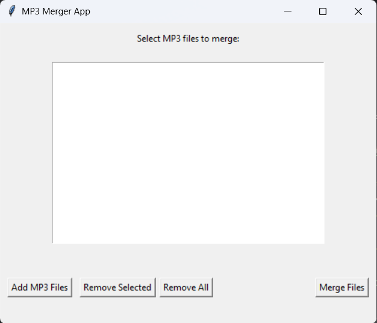

# MP3 Merger App 🎵

## Overview
MP3 Merger App is a simple Python application with a graphical user interface (GUI) for merging multiple MP3 files into a single file. It is built using Tkinter for the GUI and FFmpeg for merging the audio files.

## Features
- Add multiple MP3 files to the list.
- Remove selected files or remove all files at once.
- Merge selected MP3 files into a single output file.
- Built-in support for FFmpeg without needing it to be installed system-wide.
## Requirements
- Python 3.x
- Tkinter (usually included with Python)
- FFmpeg executable (included in the bin folder)


## Installation

* Clone the repository or download the source code.
* Ensure Python 3.x is installed on your system.
* Install the required packages:

```bash
pip install tk

```
    
## Usage/Examples
**1.** Run the application:
```bash
python merge_mp3.py
```
**2.** Use the "Add MP3 Files" button to select multiple MP3 files.

**3.** You can remove selected files or remove all files from the list.

**4.** Click "Merge Files", choose the output filename, and wait for the success message.


## Building an Executable

To create an **.exe** file, use PyInstaller:

```bash
pip install pyinstaller
pyinstaller --onefile --noconsole merge_mp3.py
```
Make sure to include the bin folder with **ffmpeg.exe** in the same directory as your **.exe.**


## Screenshots



## License

This project is licensed under the [MIT](https://choosealicense.com/licenses/mit/) License. 

